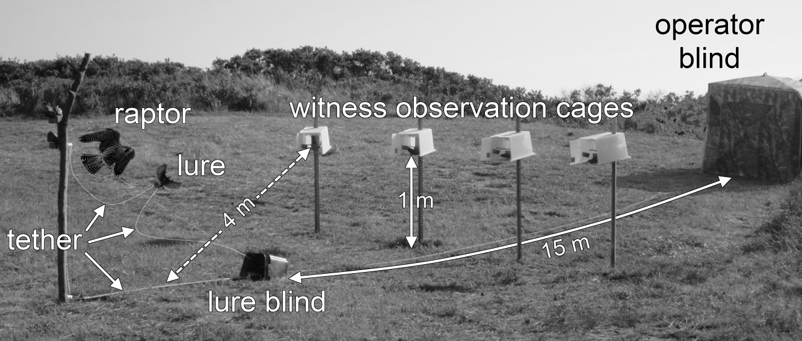

Primary questions
=================

1.  Is there a stress response (measured by CORT [ng/mL]) after
    witnessing a predator attack on a conspecific?  
2.  Is there a difference between a natural avian predator attack vs.
    human attack?

In all cases, the witnessed "attack" represents an extremely acute (2 -
8 sec) stressor, which contrasts markedly with how tests of "acute"
stressors have been performed up to this point.

Experimental design summary
===========================

**See manuscript for more details** 18 test starlings (*Sturnus
vulgaris*) observed, from a distance of 4 m, a conspecific lure
experience one of three stressors (treatments) of interest:  
1. (control) Lure not attacked, but subjects sat in observation cages
(with lure movement as in a raptor attack) for a randomly selected time
(mean ± SD: 105.0 ± 25.1 min)  
2. (human) Observation of a human "attack" on a conspecific (mean ± SD:
100.7 ± 22.8 min)  
3. (raptor) Observation of a raptor attack (usually falcon) on a
conspecific (mean ± SD: 108.0 ± 27.5 min)

  **Figure 1**. Experimental setup. See text for details.

Statistical analysis summary
============================

We evaluated the effects of attack treatment of CORT response using a
linear mixed effects model in R (version 3.0.3; R Core Team 2014) with
the nlme package (Pinheiro et al. 2014). Our experimental design
constituted an 18-sequence, 4-period, 3-treatment crossover design. The
design provided a strongly-balanced test with respect to first-order
carryover effects, allowed us to evaluate so-called 'self' and 'mixed'
carryover effects (Kumert & Stufken 2002), and guaranteed that carryover
effects were not aliased with treatment or period effects. We randomly
assigned a single individual to each of 18 unique sequences. A
"wash-out" period of at least 24 h between treatments allowed CORT to
return to baseline levels and reduced the possibility of carryover
effects in CORT measurements.

In addition to treatment, period, first-order carryover, and carryover
type (i.e., 'self' or 'mixed') effects, we allowed for a possible
interaction between carryover type and first-order carryover effects. We
also included four covariates in the analysis: active body or flight
feather molt (yes/no), witness sex and baseline CORT measured prior to
the experiment in the standardized capture and handling stress series,
and length of time waiting in observation cage prior to treatment.
Residual variance increased with the expected CORT response, so we
modelled this heterogeneity as an exponential function of the fitted
CORT values (Pinheiro and Bates 2000). We included random intercepts for
individuals and each of the 26 treatment events required to complete the
experiment; however, there was no excess variability attributable to
treatment events beyond residual variation, so we excluded this random
effect from the model. Data and code for the analysis are provided at
TBD.

Annotated R code follows:

Load aliases, functions, and necessary packages
-----------------------------------------------

    # Load some useful aliases and functions
    devtools::source_gist(9216051) # Rprofile.R
    devtools::source_gist(9216061) # various.R

    # Loading required packages
    toLoad = c("lsmeans", "multcomp", "gridExtra", "nlme", "equivalence", "plyr", 
               "psych", "bbmle", "reshape2", "ggplot2", "gtable")
    instant_pkgs(toLoad)

Load the data
-------------

Treatments (`trt`) are 1 (control), 2 (human), and 3 (raptor); `molt` is
no/yes (0/1). `cort0` and `stress0` refer to the baseline and stress
response measured before the experiment. `id` denotes the individual (n
= 18). `event` records the grouping of individuals observing a given
treatment (26 events necessary to complete the experiment). `attck_time`
notes the length of time that individuals sat in observation cages prior
to the treatment.

Raw data plots
--------------

The bottom row shows the relationship between all variables of interest
(X-axis in each) and measured CORT (Y-axis). Note the strong association
between treatment and CORT. There is essentially no multicollinearity.

Initial model fit and diagnostics
---------------------------------

We first fit an initial `lme` model that assumes homogeneous error.

    # Create grouped data set for nlme
    datGrouped <- groupedData(cort ~ trt | dGroup, data=dat)

    # This first model allows random intercepts for individuals and treatment events
    # Random effect variance for events is essentially zero so simplify model to 
    # include only individual random effect variance
    modBase <- lme(cort ~ trt + period + self + prev_human + prev_raptor + self_human + self_raptor + 
                     molt + sex + cort0 + attck_time, 
                random = pdBlocked(list(pdIdent(~id-1), pdIdent(~event-1))),
                data=datGrouped)

    # Random effect variances
    # Individual
    apply(ranef(modBase)[1, 1:18], 1, var)

    ##          1 
    ## 0.09452897

    # Event
    apply(ranef(modBase)[1, -1:-18], 1, var)

    ##            1 
    ## 1.718262e-15

    # Create new grouped data set for nlme
    datGrouped <- groupedData(cort ~ trt | id, data=dat)

    # Fit simplified base model
    modBase <- lme(cort ~ trt + period + self + prev_human + prev_raptor + self_human + self_raptor + 
                     molt + sex + cort0 + attck_time, 
                random = ~ 1,
                data=datGrouped)

    # Diagnostics from lme model
    grid.arrange(plot(modBase, type=c("p","smooth")),
                 plot(modBase, resid(., type="p") ~ as.numeric(trt)),
                 plot(modBase, sqrt(abs(resid(.)))~fitted(.), id=0.05, idLabels = ~ trt,
                      type=c("p","smooth"),ylab=expression(sqrt(abs(resid)))),
                 qqnorm(modBase,abline=c(0,1)))

Heterogeneous error model
-------------------------

The diagnostic plots from the base model indicate clear heteroscedacity
in the residuals. The natural step to accomodate variance heterogeneity
in this case is to allow separate variance estimates for each treatment.
This greatly improves the model fit and, as illustrated next, model
diagnostics.

    # Now the model allowing heterogeneity
    # First, define the variance structure
    # Vary separately for each treatment
    vId <- varIdent(form = ~ 1 | trt)

    # Fit the variances separately by treatment
    modId <- lme(cort ~ trt + period + self + prev_human + prev_raptor + self_human + self_raptor + 
                     molt + sex + cort0 + attck_time, 
                 random = ~ 1,
                 weights = vId,
                 data=datGrouped)
    AICctab(modBase, modId, nobs = nrow(dat), weights=T) # Exponential preferred 

    ##         dAICc df weight
    ## modId    0.0  19 1     
    ## modBase 14.1  17 <0.001

Model diagnostics are improved, although the control treatment remains
slightly less variable than the others.

    grid.arrange(plot(modId,type=c("p","smooth")),
                 qplot(dat$trt, resid(modId, type="p"), 
                       xlab = "Treatment", ylab = "Standardized residuals") + theme_bw(),
                 qqnorm(modId, abline=c(0,1)), ncol=2)

Assessment of fixed effects
---------------------------

First, we consider the necessity of the interaction between carryover
effect and the type of carryover effect ("self" vs. "mixed"). There's
not strong evidence of an interaction:

    ## F-test for: self_human, self_raptor 
    ##   numDF denDF   F-value p-value
    ## 1     2    43 0.7619805  0.4729

We drop this lone interaction and thus model only the additive effects
of carryover (i.e., does the treatment in the previous period influence
CORT response in the current treatment) and whether the previous
treatment was the same as ("self" carryover) or different from ("mixed"
carryover) the current treatment.

There is little evidence that birds respond differently when the attack
experienced in the preceding exposure was the same as the current
exposure ("self" carryover) compared to when the prior attack was
different from the current attack:

    ## F-test for: self 
    ##   numDF denDF  F-value p-value
    ## 1     1    45 1.729831  0.1951

nor is there much evidence that the treatment experienced in the prior
treatment influences the CORT response of the current treatment. In
other words, there is no indication of first-order carryover effects:

    ## F-test for: prev_human, prev_raptor 
    ##   numDF denDF  F-value p-value
    ## 1     2    45 2.015639  0.1451

Similarly, the CORT response to a treatment did not vary consistently
with when in the sequence (i.e., which period) the treatment occurred:

    ## F-test for: period 
    ##   numDF denDF F-value p-value
    ## 1     3    45 1.99965  0.1276

Nuisance covariates
-------------------

Before addressing the treatment effects, note than none of the
covariates (baseline CORT, molt, sex, attack time) explained much
variation in CORT response, although birds that sat in the observation
cages for longer periods of time tended to have increased CORT
responses. This should be interpreted with caution, however, as the
tests reported here are too "optimistic" in the sense that the F-test
probably needs some adjustment to correct the denominator degrees of
freedom (e.g., the Kenward-Roger approximation). The K-R adjustment is
not available in R for `lme` models, but the same model in SAS, which
does offer the K-R adjustment, suggests that the positive association
between time spent in the observation cage and CORT response is marginal
(*p* = 0.05). Nonetheless, this positive association is **opposite** of
what might be expected if birds were still returning to baseline when
the earliest attacks occurred.

    ## F-test for: cort0 
    ##   numDF denDF  F-value p-value
    ## 1     1    14 1.529241  0.2366

    ## F-test for: molt 
    ##   numDF denDF     F-value p-value
    ## 1     1    14 0.002355153   0.962

    ## F-test for: sex 
    ##   numDF denDF  F-value p-value
    ## 1     1    14 1.626417   0.223

    ## F-test for: attck_time 
    ##   numDF denDF  F-value p-value
    ## 1     1    45 5.255359  0.0266

Treatment effects
-----------------

In contrast to other covariates, there is very clear evidence that the
stress response varies among treatments, and that all treatments are
different from each other. The evidence remains very strong after
adjusting degrees of freedom:

    ## F-test for: trt 
    ##   numDF denDF  F-value p-value
    ## 1     2    45 88.81174  <.0001

    ## $lsmeans
    ##  trt    lsmean       SE df asymp.LCL asymp.UCL
    ##  1    9.693049 1.578713 NA  6.598453  12.78764
    ##  2   23.855331 1.988756 NA 19.956969  27.75369
    ##  3   37.132125 3.308755 NA 30.646298  43.61795
    ## 
    ## Results are averaged over the levels of: period, self, prev_human, prev_raptor, molt, sex 
    ## Confidence level used: 0.95 
    ## 
    ## $contrasts
    ##  contrast  estimate       SE df    z.ratio p.value
    ##  1 - 2    -14.16228 1.377370 NA -10.282117  <.0001
    ##  1 - 3    -27.43908 2.993482 NA  -9.166275  <.0001
    ##  2 - 3    -13.27679 3.207987 NA  -4.138668  0.0001
    ## 
    ## Results are averaged over the levels of: period, self, prev_human, prev_raptor, molt, sex 
    ## P value adjustment: tukey method for a family of 3 means

  
**Figure 2**. Total plasma corticosterone measured from 18 starlings
during a pre-experimental standard handling stress series (baseline) and
three experimental treatments. All samples were collected within 3
minutes of initial human contact. See text for a description of the
pre-experiment stress series and experimental treatments.

Equivalence tests
-----------------

We formally evaluate the equivalence of the stress response to a raptor
attack to the handling stress response in the pre-experiment stress
series. We do likewise for the stress response of the control treatment
to the pre-experiment baseline stress response. Tests of equivalence
require an *a priori* specification of how much measurements can differ
and still be considered equivalent - we specify it as the standard
deviation of the relevant pre-experiment stress series measurements.
Thus, for the comparison of experimental control vs.
capture-and-restraint baseline CORT, differences less than 3.6394821
ng/mL are considered biologically equivalent. For the comparison of
experimental raptor attack vs. capture-and-restraint stress CORT,
differences less than 10.9964158 ng/mL are considered biologically
equivalent.

Two one-sided tests for equivalence (TOST; Schuirmann 1981, Westlake
1981) indicate that in both cases the experimental and
capture-and-restraint measurements are equivalent as we have defined it.
That is, the null hypothesis that the measurements were dissimilar was
rejected in both cases (experimental control vs. capture-and-restraint
baseline CORT: *p* = 0.006; experimental raptor attack vs.
capture-and-restraint stress CORT: *p* = 0.002). It's worth noting,
perhaps, that a similar conclusion is reached using a "strict" paired
t-test of equivalence (as defined by Wellek 2003).
